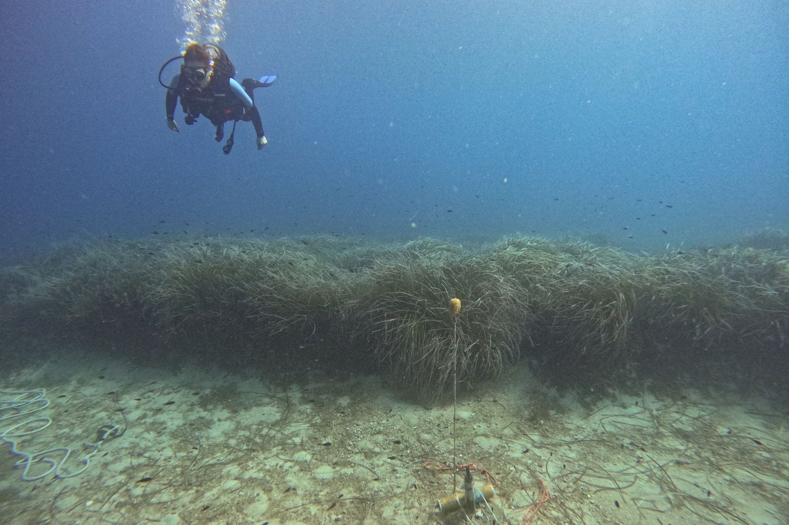

# Posidonia Soundscapes: Conservation & Music, Ibiza

Posidonia Soundscapes is an interdisciplinary project connecting marine
soundscape research, the conservation of *Posidonia oceanica* meadows, and
music in Ibiza. This public repository gathers reusable methods, code,
selected acoustic examples, metadata, figures, and research outputs.

> **Status:** Active repository. Materials will be added as they are reviewed
> for scientific quality, authorship, privacy, and reuse permissions.

| Acoustic deployment in a *Posidonia oceanica* meadow | *Posidonia oceanica* soundscape habitat |
|---|---|
|  |  |
| Photo: Music for the Sea | Photo: @fisharefriends.film and @supersesagrass |

## Repository contents

| Directory | Contents |
|---|---|
| [`scripts/`](scripts/) | MATLAB, Python, and notebook-based analysis tools |
| [`characteristic-sounds/`](characteristic-sounds/) | Curated short sound clips and metadata records |
| [`data/`](data/) | Small CSV files, metadata, and data dictionaries |
| [`figures/`](figures/) | Spectrograms, maps, and derived visual results |
| [`methods/`](methods/) | Equipment, deployment, calibration, and processing methods |
| [`publications/`](publications/) | Publications, DOI records, presentations, and related links |
| [`outreach/`](outreach/) | Music, art, education, and public-engagement activities |

## Data access

The complete acoustic recordings are too large for GitHub and are not stored
in this repository. Researchers who need access to the underlying data may
submit a justified request to
[neus.perez@uca.es](mailto:neus.perez@uca.es) or
[servicioacustica.inmar@uca.es](mailto:servicioacustica.inmar@uca.es).
Access is subject to data ownership, ethical, legal, and collaboration terms.

## Reuse and citation

Code is released under the [MIT License](LICENSE). Data, figures, and sound
clips explicitly identified as reusable are released under
[CC BY 4.0](LICENSE-DATA.md). Third-party material retains its original terms.
Please use [`CITATION.cff`](CITATION.cff) to cite this repository.

Photo credits and reuse terms are documented in [`assets/README.md`](assets/README.md).

## Contact

**Neus Perez Gimeno** 
University Institute of Marine Research (INMAR), University of Cadiz 
[neus.perez@uca.es](mailto:neus.perez@uca.es)
